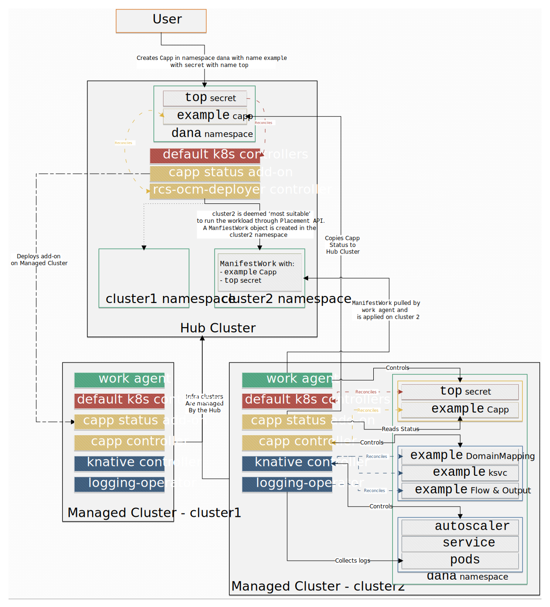

# How it Work

 

1. The client creates the `Capp` CR in a Namespace on the Hub Cluster.

2. The `rcs-ocm-deployer` controller on Hub Cluster watches for `Capp` CRs and reconciles them.

3. The controller chooses the ‘most suitable’ Managed Cluster to deploy the `Capp` workload using the `Placement` API.

4. Each Managed Cluster on the Hub Cluster has a dedicated namespace. The controller creates a `ManifestWork` object on the Hub Cluster in the namespace of the chosen Managed Cluster.

5. The Managed Cluster pulls the `ManifestWork` from the Hub Cluster using the `work agent` and creates a `Capp` CR on the Managed Cluster.

6. The `capp controller` reconciles the `Capp` CRs in the cluster and creates (if needed) a `Knative Service` (`ksvc`) CR, a `DommainMapping` CR, and `Flow` & `Output` CRs for every Capp.

7. The `knative controller` reconciles the `ksvc` CRs in the cluster and controls the lifecycle an autoscaler and pods relevant to the `ksvc`.

8. The `logging-operator controller` reconciles the `Flow` and `Output` CRs in the cluster and collects logs from the pods' `stdout` and sends them to a pre-existing `Elasticsearch` or `Splunk` index.

9. A status is returned from the Managed Cluster to the Hub Cluster using an `OCM AddOn`.

### The RCS controllers

The following contollers are part of the [`rcs-ocm-deployer`](https://github.com/dana-team/rcs-ocm-deployer) project:

1. `cappPlacement`: The controller adds an annotation containing the chosen Managed Cluster to deploy the `Capp` workload on, in accordance to the `placementDecision` and the desired `Site`.

2. `cappPlacementSync`: The controller controls the lifecycle of the `ManifestWork` CR in the namespace of the chosen Managed Cluster. The `ManifestWork` contains the `Capp` CR as well as all the `Secrets` and `Volumes` referenced in the `Capp` CR, thus making sure that all the `Secrets` and `Volumes` also exist on the Managed Cluster, in the same namespace the `Capp CR` exists in on the Hub Cluster.

3. `addOns`: By applying this add-on to your `OCM` Hub Cluster, the `Capp` status will automatically be synced back from Managed/Spoke Clusters to the Hub cluster. It has two components: `agent` - deployed on the Managed/Spoke clusters; responsible for syncing the `Capp` status between the Managed Cluster and the Hub Cluster; `manager` - deployed on the Hub Cluster; responsible for deploying the `agent` on the Managed/Spoke clusters.
